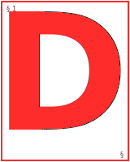
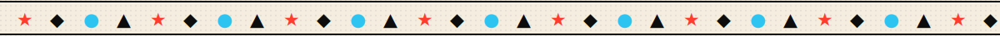

<!--
  EMRE ERIM — github profile
  editorial brutalist layout · hand-written in svg + markdown
  no templates · no badge farm · no random dev quote
-->

<picture>
  <source media="(prefers-color-scheme: dark)" srcset="assets/banner-dark.svg">
  <source media="(prefers-color-scheme: light)" srcset="assets/banner-light.svg">
  
</picture>

&nbsp;

<table>
<tr>
<td valign="top" width="150">
  
</td>
<td valign="top">

&nbsp;

**esigner-developer hybrid from Istanbul.** I build interfaces at [**Erim.dev**](https://eerim.dev) and make vinyl toys on the side. My work sits between pixel precision and 3D figure craft — two hands, one eye, one very loud espresso machine.

No _"Hi 👋 I'm Emre"_. No shields farm. No random dev quote. Just work.

</td>
</tr>
</table>

&nbsp;



&nbsp;

### `/01 — NOW`

```txt
   last commit to this page   2026.04.22
   ────────────────────────────────────────────────────

   ▸  building     erim.dev v3 — personal studio site
   ▸  designing    a product identity for a skincare label
   ▸  making       vinyl toy series — SKU-04 prototype
   ▸  reading      refactoring ui (adam wathan)
   ▸  listening    arca · fred again.. · caribou
```

&nbsp;


&nbsp;

### `/02 — STACK`

```txt
   DESIGN      figma       framer        blender       adobe cc
               sketch      illustrator   photoshop     lightroom

   CODE        typescript  next.js       node          tailwind
               html5       css3          javascript

   MAKING      blender     after fx      resin cast    photography

   DATA        postgres    mongodb       mssql         supabase
```

> The tool is only the pen — the hand is what makes the mark.

&nbsp;


&nbsp;

### `/03 — SELECTED WORKS`

<table>
<tr>
<td valign="top" width="80">
<sub><code>2025</code></sub>
</td>
<td valign="top" width="40" align="center">
<sub>█</sub>
</td>
<td valign="top">
<strong>N° 04 &nbsp;—&nbsp; Product Identity</strong><br>
<sub>UI/UX · web · brand system &nbsp;·&nbsp; <a href="https://www.behance.net/emreerim">behance ↗</a></sub>
</td>
</tr>
<tr>
<td valign="top" width="80">
<sub><code>2024</code></sub>
</td>
<td valign="top" width="40" align="center">
<sub>█</sub>
</td>
<td valign="top">
<strong>N° 03 &nbsp;—&nbsp; Motion Study</strong><br>
<sub>motion · 3D · after effects &nbsp;·&nbsp; <a href="https://www.behance.net/emreerim">behance ↗</a></sub>
</td>
</tr>
<tr>
<td valign="top" width="80">
<sub><code>2024</code></sub>
</td>
<td valign="top" width="40" align="center">
<sub>█</sub>
</td>
<td valign="top">
<strong>N° 02 &nbsp;—&nbsp; Dashboard System</strong><br>
<sub>UI/UX · design system · figma &nbsp;·&nbsp; <a href="https://www.behance.net/emreerim">behance ↗</a></sub>
</td>
</tr>
<tr>
<td valign="top" width="80">
<sub><code>2023</code></sub>
</td>
<td valign="top" width="40" align="center">
<sub>█</sub>
</td>
<td valign="top">
<strong>N° 01 &nbsp;—&nbsp; SKU-01 Toy Series</strong><br>
<sub>object · resin cast · photography &nbsp;·&nbsp; <a href="https://www.behance.net/emreerim">behance ↗</a></sub>
</td>
</tr>
</table>

<sub>→ Full index at &nbsp;<a href="https://www.behance.net/emreerim"><strong>behance.net/emreerim</strong></a></sub>

&nbsp;


&nbsp;

### `/04 — METRICS`

<picture>
  <source media="(prefers-color-scheme: dark)" srcset="https://github-readme-stats.vercel.app/api?username=Emreerm&show_icons=true&hide_border=true&bg_color=0A0A0A&title_color=FF2C2C&icon_color=FF2C2C&text_color=F5F2EC&custom_title=SYSTEM+OUTPUT&include_all_commits=true&count_private=true&rank_icon=percentile">
  <source media="(prefers-color-scheme: light)" srcset="https://github-readme-stats.vercel.app/api?username=Emreerm&show_icons=true&hide_border=true&bg_color=F5F2EC&title_color=FF2C2C&icon_color=FF2C2C&text_color=0A0A0A&custom_title=SYSTEM+OUTPUT&include_all_commits=true&count_private=true&rank_icon=percentile">
  
</picture>

&nbsp;


&nbsp;

<picture>
  <source media="(prefers-color-scheme: dark)" srcset="assets/cta-lets-work-dark.svg">
  <source media="(prefers-color-scheme: light)" srcset="assets/cta-lets-work-light.svg">
  
</picture>

&nbsp;

```txt
   ↗  mail        emre.uiux@gmail.com
   ↗  work        behance.net/emreerim
   ↗  writing     eerim.dev
   ↗  linkedin    linkedin.com/in/emreeerm
   ↗  twitter     twitter.com/emreeerm
   ↗  instagram   instagram.com/emreeerm
```

<p align="center">
<a href="mailto:emre.uiux@gmail.com"><strong>&nbsp;✉&nbsp;&nbsp;mail&nbsp;</strong></a>
&nbsp;·&nbsp;
<a href="https://www.behance.net/emreerim"><strong>&nbsp;◇&nbsp;&nbsp;behance&nbsp;</strong></a>
&nbsp;·&nbsp;
<a href="https://eerim.dev"><strong>&nbsp;◉&nbsp;&nbsp;erim.dev&nbsp;</strong></a>
&nbsp;·&nbsp;
<a href="https://linkedin.com/in/emreeerm"><strong>&nbsp;in&nbsp;&nbsp;linkedin&nbsp;</strong></a>
&nbsp;·&nbsp;
<a href="https://twitter.com/emreeerm"><strong>&nbsp;↗&nbsp;&nbsp;twitter&nbsp;</strong></a>
&nbsp;·&nbsp;
<a href="https://instagram.com/emreeerm"><strong>&nbsp;◎&nbsp;&nbsp;instagram&nbsp;</strong></a>
</p>

&nbsp;

&nbsp;

<picture>
  <source media="(prefers-color-scheme: dark)" srcset="assets/signature-dark.svg">
  <source media="(prefers-color-scheme: light)" srcset="assets/signature-light.svg">
  
</picture>

<!--
  colophon
  ──────────────────────────────────────────────────
  set in Fraunces (display) & JetBrains Mono (meta).
  hand-written in svg + markdown by ee.
  no random quote widget. no visit counter. no gprm.
-->
