<!--
  SYS.EMRE.ERIM — github profile v2.3
  single-box cyberpunk HUD — hero + telemetry + CTA + contact
  one SVG · one frame · one background
  no templates · no badge farm · no random dev quote
-->

<h3 align="center">
  &nbsp;
  <a href="mailto:emre.uiux@gmail.com"><kbd>&nbsp;&nbsp;<b>✉&nbsp;&nbsp;MAIL</b>&nbsp;&nbsp;</kbd></a>
  &nbsp;
  <a href="https://www.behance.net/emreerim"><kbd>&nbsp;&nbsp;<b>◇&nbsp;&nbsp;BEHANCE</b>&nbsp;&nbsp;</kbd></a>
  &nbsp;
  <a href="https://eerim.dev"><kbd>&nbsp;&nbsp;<b>◉&nbsp;&nbsp;ERIM.DEV</b>&nbsp;&nbsp;</kbd></a>
  &nbsp;
  <a href="https://linkedin.com/in/emreeerm"><kbd>&nbsp;&nbsp;<b>in&nbsp;&nbsp;LINKEDIN</b>&nbsp;&nbsp;</kbd></a>
  &nbsp;
  <a href="https://twitter.com/emreeerm"><kbd>&nbsp;&nbsp;<b>↗&nbsp;&nbsp;TWITTER</b>&nbsp;&nbsp;</kbd></a>
  &nbsp;
  <a href="https://instagram.com/emreeerm"><kbd>&nbsp;&nbsp;<b>◎&nbsp;&nbsp;INSTAGRAM</b>&nbsp;&nbsp;</kbd></a>
  &nbsp;
</h3>

<!--
  colophon
  ──────────────────────────────────────────────────
  one unified SVG · no more fragmented panels
  set in JetBrains Mono · lit by #00F0FF and #FF006E
  bg #0d1117 matches github dark exactly
  handwritten by ee · no gprm · no badge farm
-->
