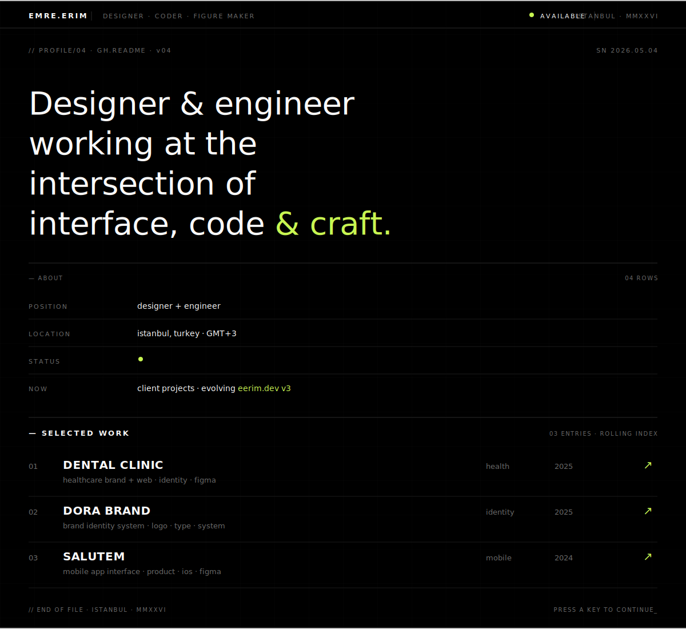

<!--
  EMRE ERIM — github profile · v05 (brutalist mono studio)
  ──────────────────────────────────────────────────
  designer + engineer · istanbul
  one composition · monospace · pure black + chartreuse + bone
  no emojis · no badges · no shields · no humblebrag
-->

  

  <code>// ELSEWHERE</code>

<pre>
→ SITE         <a href="https://eerim.dev">eerim.dev</a>
→ BEHANCE      <a href="https://www.behance.net/emreerim">behance.net/emreerim</a>
→ LINKEDIN     <a href="https://linkedin.com/in/emreeerm">linkedin.com/in/emreeerm</a>
→ TWITTER      <a href="https://twitter.com/emreeerm">twitter.com/emreeerm</a>
→ INSTAGRAM    <a href="https://instagram.com/emreeerm">instagram.com/emreeerm</a>
→ MAIL         <a href="mailto:emre.uiux@gmail.com">emre.uiux@gmail.com</a>
</pre>

  <code>// EOF · v05 · MMXXVI · ISTANBUL</code>

<!--
  colophon
  ──────────────────────────────────────────────────
  set in JetBrains Mono · pure black bg · chartreuse #C7F551
  one studio.svg · github stats re-skinned · pre-block links
  v01 banner · v02 hud · v03 system · v04 riso press · v05 studio
-->
