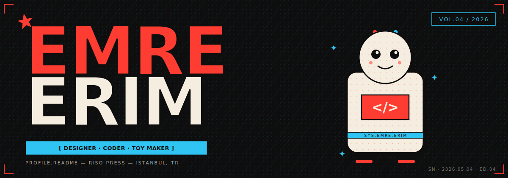
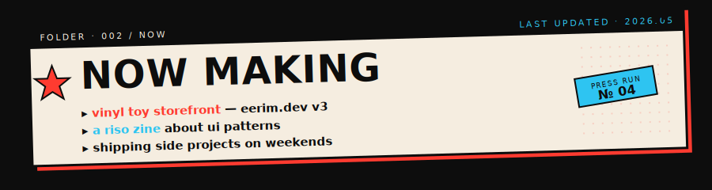
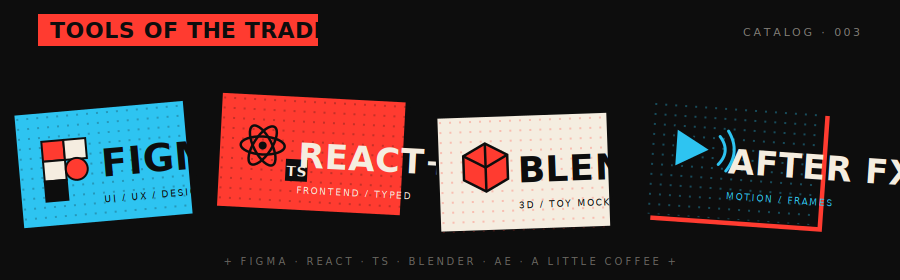
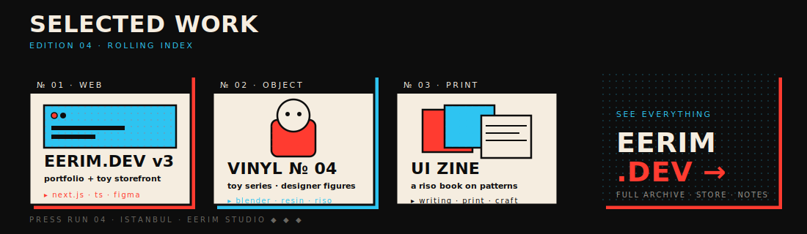
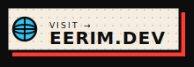
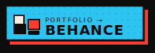
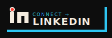
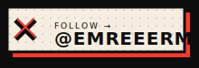
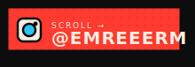
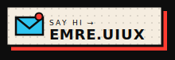

<!--
  EMRE ERIM — github profile · v04
  ──────────────────────────────────────────────────
  riso pop press · designer / coder / vinyl toy engineer
  red #FF3B30 · cyan #2EC4F1 · cream #F5EDE0 · matte #0D0D0D
  no badge farm · no shields.io · everything hand-made
-->

  

  

  

  

  

  

<h2>
  ◆ ◆ ◆&nbsp;THE&nbsp;NUMBERS
</h2>

  
  

  

  

  

  

<h2>
  ◆ ◆ ◆&nbsp;FIND&nbsp;ME&nbsp;ELSEWHERE
</h2>

  &nbsp;
  &nbsp;
  

  &nbsp;
  &nbsp;
  

 

  <code>made with riso ink and bad sleep · vol.04 · 2026 · istanbul</code>

<!--
  colophon
  ──────────────────────────────────────────────────
  set in anton + jetbrains mono · printed in halftone
  every sticker hand-tilted · no rotation by accident
  v01 was a banner · v02 a hud · v03 a system · v04 a press
-->
