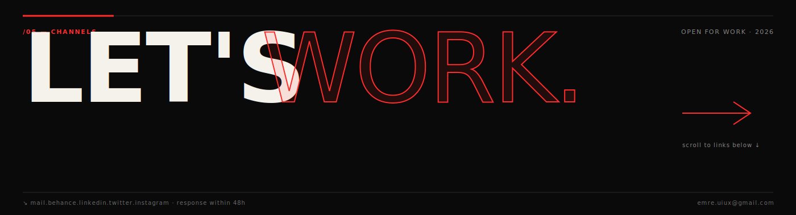
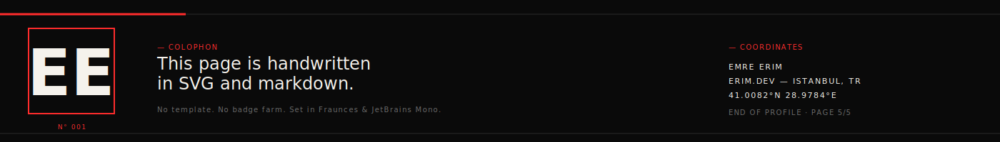

<!--
  SYS.EMRE.ERIM — github profile v2.0
  cyberpunk HUD · hand-written in svg + markdown
  no templates · no badge farm · no random dev quote
-->

<table width="100%">
<tr>
<td width="120" valign="top" align="right">

<code>//&nbsp;BIO</code> 
<code>0x000</code>

</td>
<td valign="top">

<pre><code>&gt; designer-developer hybrid ops out of istanbul.tr
&gt; shipping interfaces at erim.dev · casting vinyl toys at night
&gt; two hands · one eye · one very loud espresso machine
&gt; no "hi i'm emre" · no shields farm · just transmission.</code></pre>

</td>
</tr>
<tr>
<td valign="top" align="right">

<code>/01</code> 
<code>STATUS.SYS</code>

</td>
<td valign="top">

<pre><code>▸ NODE      IST-01  /  istanbul.tr
▸ UPTIME    07Y 198D  ·  last.ping 2026.04.23
▸ EXEC      building erim.dev v3
▸ TASK      identity system for a skincare label
▸ CRAFT     vinyl toy series · SKU-04 prototype
▸ READ      refactoring ui (adam wathan)
▸ STREAM    arca · fred again.. · caribou</code></pre>

</td>
</tr>
<tr>
<td valign="top" align="right">

<code>/02</code> 
<code>LOADOUT</code>

</td>
<td valign="top">

<pre><code>[ DESIGN ]   figma      framer      blender     adobe.cc
             sketch     illustrator photoshop   lightroom
[ CODE   ]   typescript next.js     node        tailwind
             html5      css3        javascript
[ MAKE   ]   blender    after.fx    resin       photography
[ DATA   ]   postgres   mongodb     mssql       supabase</code></pre>

</td>
</tr>
<tr>
<td valign="top" align="right">

<code>/03</code> 
<code>ARCHIVE</code>

</td>
<td valign="top">

<pre><code>[2025]  ▓  N°04  product identity           →  <a href="https://www.behance.net/emreerim">behance</a>
[2024]  ▓  N°03  motion study               →  <a href="https://www.behance.net/emreerim">behance</a>
[2024]  ▓  N°02  dashboard system           →  <a href="https://www.behance.net/emreerim">behance</a>
[2023]  ▓  N°01  SKU-01 toy series          →  <a href="https://www.behance.net/emreerim">behance</a>
                                               <a href="https://www.behance.net/emreerim">all works ↗</a></code></pre>

</td>
</tr>
<tr>
<td valign="top" align="right">

<code>/04</code> 
<code>TELEMETRY</code>

</td>
<td valign="top">

</td>
</tr>
<tr>
<td valign="top" align="right">

<code>/05</code> 
<code>CONNECT</code>

</td>
<td valign="top">

<pre><code>▸ MAIL       <a href="mailto:emre.uiux@gmail.com">emre.uiux@gmail.com</a>
▸ WORK       <a href="https://www.behance.net/emreerim">behance.net/emreerim</a>
▸ WRITING    <a href="https://eerim.dev">eerim.dev</a>
▸ LINKEDIN   <a href="https://linkedin.com/in/emreeerm">linkedin.com/in/emreeerm</a>
▸ TWITTER    <a href="https://twitter.com/emreeerm">twitter.com/emreeerm</a>
▸ INSTAGRAM  <a href="https://instagram.com/emreeerm">instagram.com/emreeerm</a></code></pre>

</td>
</tr>
</table>

<!--
  colophon
  ──────────────────────────────────────────────────
  set in JetBrains Mono · lit by #00F0FF and #FF006E
  handwritten in svg + markdown by ee
  no gprm · no badge farm · no random quote widget
-->
